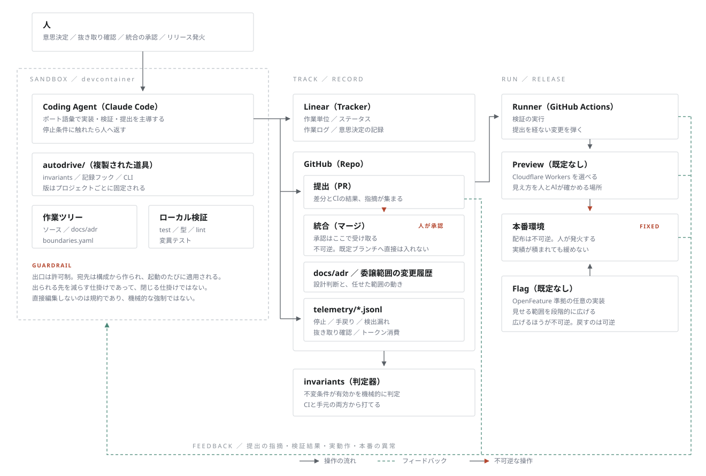

# autodrive-dev-kit

**システム開発に精通していなくても、AIの案内で開発を進められるようにするための autodrive-dev-kit。**

[AIオートドライビング開発](https://github.com/hajimegane/autodrive-dev-definition)の参照実装。

*English version: [README.md](README.md)*

## 何を目指しているか

**人のスキルレベルによらず、一定の品質で開発できるようにすること。**

速く作れることは目的ではない。**速いだけなら、AIに書かせれば誰でもできる。** 問題は、速く作ったものが正しいかを誰が確かめるかである。ふつうそれは人の熟練に頼っている。**熟練が無いと、速さがそのまま危うさになる。**

この手法は、そこを熟練ではなく仕組みで担保する。

| 何を | どういうことか |
|---|---|
| **AIが主導する** | 環境構築も、着手も、記録も、判定もAIが行う。人が決めるのは、何を作るか・どう見せるか・どの順に作るか |
| **前提知識を要求しない** | 問いかけも説明も、実装まわりの専門用語ではなく人の言葉で行う。**読めない説明は、確認できない説明である** |
| **任せた範囲が正しかったかを測る** | どこまで任せてよいかは、宣言ではなく記録で決める。うまくいっていない範囲は戻す |

3つ目が、この手法の中心にある。**「AIに任せてよい」と言い切らない。** 任せた範囲がどう働いたかを記録し、広げるかどうかを実測で決める。

## どう実現しているか

任せられる状態を保つために、次の3つを備える。

| 要素 | 内容 |
|---|---|
| **不変条件** | 提出を経ない変更が既定ブランチへ入らない。本番の資格情報を手元に置かない |
| **記録** | 停止、手戻り、検出漏れ、委譲範囲の変更、トークン消費が自動で残る |
| **判定** | 上の2つが実際に機能しているかを機械的に判定する。宣言ではなく実測 |

記録は、仕組みを改善するために利用される。

## いまの状態

**育てている途中である。** まだ公開しておらず、autodrive-dev-kit で作っているプロジェクトは2つ。

**autodrive-dev-kit 自身が、この手法で開発されている。** 参照実装の変更も、作業単位の起票から提出・統合まで、ここに書かれている手順を通っている。**書いた本人が従わない規約にしないため。**

不変条件の4つのうち3つが有効で、1つは人が手で代替している（判定がその状態を出す）。詳しくは [docs/invariants.md](docs/invariants.md)。

## 必要要件

| コンポーネント | 用途 | 要否 |
|---|---|---|
| Node 22.18 以上 | autodrive-dev-kit の実行 | 必須 |
| Linear | 作業単位の起票、状態管理、記録の紐づけ | 必須 |
| GitHub | 提出を経た統合。判定がここを読む | 必須 |
| Cloudflare Workers | 画面の見え方を確認するためのプレビュー | 画面を持つ場合 |

## 使い方

### はじめ方

導入するプロジェクトのディレクトリで実行する。

```sh
cd <あなたのプロジェクト>
npx github:hajimegane/autodrive-dev-kit init
```

**clone も PATH の設定も要らない。** Node 22.18 以上があれば動く（型注釈をそのまま実行するため）。

打つのが長いので、置き場所を決めて PATH へ通してもよい。

```sh
export PATH="$PATH:<この参照実装の置き場所>/bin"
autodrive-dev-kit init
```

構成について質問される。**最初に言語を聞かれる**（日本語 / English）。選択肢と推奨が表示されるので、番号を入力するか、そのまま Enter を押す。回答は `autodrive.json` に保存され、次回以降は質問されない。

**言語の設定が効くのは、このセットアップの表示だけである。** 開発の会話は、AIが相手の言語で行う。

| コマンド | 用途 |
|---|---|
| `init` | 新規に導入する。構成を質問して、ファイルを配置する |
| `apply` | 既存プロジェクトに導入する。配置済みのファイルから構成を推測し、確認を求める |

**人が打つのはここまでである。** この2つは、打つ時点でプロジェクトもAIもまだ無い。

配置された `.env.example` を複製して `.env` を作成し、資格情報を記入する。手動の作業はここまでである。

### autodrive-dev-kit を更新する

一度導入した kit を更新する場合、以下のように AI に作業を依頼する。

> autodrive-dev-kit を最新化したい

上記にて、AI が作業単位の起票から更新、提出までを行う。人は統合を承認するだけでよい。

**人が直接 `update` を打たないこと。** 更新はプロジェクトの追跡ファイルを書き換える変更であり、提出を経ずに既定ブランチへ入れることになる。

**上げ先のバージョンを指すこともできる。** 統合のたびにタグが打たれるため、最新ではなく特定の版を選べる（[ADR 0006](docs/adr/0006-version-bump-policy.md)）。

> autodrive-dev-kit を v0.1.1 にしたい

### 開発の進め方

Claude Code を開いて、**「プロジェクトを始めたい」と伝えてください。**

その後は、AIがプロジェクトの状態を見て開発を進めてくれます。

| | AIが実行すること | 人が判断すること |
|---|---|---|
| 1 | 何を作るか・なぜ作るかを聞き取り、文書化して読み上げる | 話す |
| 2 | 画面を持つ場合、見え方の案を提示する | **選ぶ** |
| 3 | 開発順序の案と判断材料を提示する | **決める** |
| 4 | 環境を構築する。AIが実行できない操作のみ依頼する | 資格情報の発行など |
| 5 | 作業単位を起票し、実装する | |

**開発に必要な環境は、必要に応じて徐々に構築していきます。**

#### 提出に、前の作業単位の記録が1件だけ混ざります

**普通は、その作業と関係の無いものが提出に入ることはありません。** ここだけ例外なので、先に断っておきます。

提出を見ると、その作業単位とは**別の** `telemetry/AUT-nnn.jsonl` が1件入っていることがあります。**壊れているわけでも、AIが余計なものを混ぜたわけでもありません。**

トークン消費の記録は、AIが**報告して止まった時点**で書かれます。止まるのはコミットと提出のあとなので、**最後の1件は、その作業単位の提出には間に合いません。** 次に着手したときに拾われ、そちらの提出に乗ります。

| 気になるところ | どうなっているか |
|---|---|
| 混ざるもの | `telemetry/` の中の記録だけ。他のファイルには触りません |
| 記録の中身 | **元の作業単位のもののままです。** 集計の宛先は変わりません |
| すること | ありません。そのまま統合してください |

**この形は暫定です。** 記録をブランチの外へ置く方式を別に検討しています。

## 関連ファイル、フォルダ

以下は autodrive-dev-kit に関連するファイル、フォルダである。

```
my-app/
├── autodrive/                       autodrive-dev-kit の複製
├── autodrive.json                   構成
├── boundaries.yaml                  委譲範囲の表
├── CLAUDE.md                        プロジェクト固有の規約
├── .env.example                     必要な資格情報の一覧。**構成から作られる**
├── .gitignore
├── notes/
│   └── README.md                    **人が使う置き場所。** 中身は追跡しない
├── .claude/
│   └── settings.json                記録のフックの登録
├── .github/
│   └── workflows/invariants.yml         判定をCIで実行する定義
├── docs/
│   ├── autodrive.md                 AI向けの作業規約
│   ├── what-why.md                  何を作るか、なぜ作るか
│   ├── quality.md                   品質で守ること、守らないと決めたこと
│   ├── adr/                         設計判断の記録
│   └── boundary-changes.md          委譲範囲の変更の履歴
├── telemetry/
│   └── <作業単位ID>.jsonl            停止、手戻り、トークン消費の記録
└── test/                            テスト
```

これらは段階に応じて作成されていく。

| ファイル | 作成 | 所有 | 内容 |
|---|---|---|---|
| `autodrive/` | init | autodrive-dev-kit | 複製されたもの。`update` で入れ替わる |
| `.env.example` | init | autodrive-dev-kit | 必要な資格情報の一覧。**構成から作られる** |
| `.github/workflows/invariants.yml` | init | autodrive-dev-kit | 判定をCIで実行する定義 |
| `.devcontainer/` | init | autodrive-dev-kit | 隔離のロジック（firewall・準備・許可ドメイン一覧）。**外向き通信は許可制** |
| `.devcontainer/devcontainer.json` | init | プロジェクト | サンドボックスの定義。**直接編集してよい。** 隔離の設定は `invariants` が見る |
| `.devcontainer/devcontainer-lock.json` | init | プロジェクト | バージョンの固定。**最初の一度だけ置く。** 以後は作り直しのたびに Dev Containers CLI が書き換える |
| `docs/autodrive.md` | init | autodrive-dev-kit | AI向けの作業規約。**振る舞いとスタンスを含む。** 毎回読む |
| `docs/autodrive-reference.md` | init | autodrive-dev-kit | なぜ・どう測るか・過去に何が起きたか。**引くもので、毎回は読まない** |
| `autodrive.json` | init | プロジェクト | 構成。`update` でも変更されない |
| `boundaries.yaml` | init | プロジェクト | 委譲範囲の表。どの領域をAIに任せているか |
| `docs/what-why.md` | init | プロジェクト | 何を作るか、なぜ作るか |
| `docs/quality.md` | init | プロジェクト | 品質で守ること、意図して守らないと決めたこと |
| `CLAUDE.md` | init | プロジェクト | プロジェクト固有の規約 |
| `.gitignore` | init | プロジェクト | 資格情報と作業状態を除外する |
| `notes/README.md` | init | プロジェクト | **人が使う置き場所。** 考えをまとめる。中身は追跡しない |
| `.claude/settings.json` | init | プロジェクト | 記録のフックを**追記**する。既存の登録は保持される |
| `telemetry/<作業単位ID>.jsonl` | 着手したとき | プロジェクト | 停止、手戻り、トークン消費の記録 |
| `test/` | 実装したとき | プロジェクト | テスト |
| `docs/adr/` | 設計判断が生じたとき | プロジェクト | 設計判断の記録 |
| `docs/boundary-changes.md` | 委譲範囲の表を動かしたとき | プロジェクト | 委譲範囲の変更の履歴 |

autodrive-dev-kit が所有するファイルは `update` で上書きされる。プロジェクトが所有するファイルは、既に存在する場合は変更されない。

`init` の時点では、下4つは作成されない。**プロジェクト固有の内容を持つため、空のテンプレートは置かない。**

## 仕組み

構成と、1件の変更が流れる経路。**各要素はポートとして差し替えられる。** 図に出ているのは既定の構成である。



### autodrive-dev-kit はプロジェクトの中に複製される

```
  <参照実装>                        <あなたのプロジェクト>

  autodrive-dev-kit/                my-app/
    src/
      vendored/   ───── init ─────▶   autodrive/       autodrive-dev-kit の複製
      templates/  ──── 生成 ───────▶   docs/            規約 / What・Why
    VERSION                           .github/         CI
    LICENSE                           autodrive.json   構成
```

autodrive-dev-kit を更新しても、`update` を実行するまでプロジェクトは変化しない。プロジェクトごとに異なるバージョンで動作する（[ADR 0004](docs/adr/0004-vendored-kit.md)）。

### 内側ループと外側ループ

```
  内側   実装 ──▶ 検出手段が判定 ──▶ 修正        AIだけで完結する
                                                 人は呼ばれない

  外側   記録を読む ──▶ 改善案 ──▶ 人が承認      停止の回数そのものを減らす
```

どの領域をAIに任せているかは `boundaries.yaml` が持つ。**この表のセルを動かす変更は外側ループであり、人の承認を要する。** 新しい検出手段の導入も同様である。

### 不変条件の判定

配置された仕組みが実際に機能しているかを `invariants` が判定する。CIから自動実行され、手動でも実行できる。

```sh
autodrive/invariants --root . --scope self
```

見るのは次の4つである。**どれも、上で説明した2つのループが成り立つための前提にあたる。**

| 見るもの | 成り立たないと何が起きるか |
|---|---|
| 外側ループが起動し、継続しているか | 記録が溜まるだけで、仕組みの改善に使われない |
| 記録が残っているか | 外側ループの入力そのものが無くなる |
| 委譲範囲の変更が履歴に残っているか | いつ何を任せたのかが追えなくなる |
| AIがこれらを無効化できないか | 上の3つが、いつでも外せる状態になる |

出力は次の形になる。

```
[有効]    テレメトリが記録されること
[代替]    AIがこれらを無効化できないこと
[要対応]  委譲範囲の変更が履歴に残ること
```

状態は4つある（定義§9）。**どれも「いま何であるか」を言う。**

| 状態 | 意味 | 「記録が残っているか」の例 |
|---|---|---|
| **有効** | 仕組みとして働いている。人が意識しなくても守られ、忘れることができない | フックが登録されていて、記録が自動的に残る |
| **代替** | まだ仕組みになっておらず、人が手で肩代わりしている | 人が思い出して手で記録している。肩代わりの事実も記録に残っている |
| **要対応** | 肩代わりの記録が無い、または有効かどうかを判定できない | 手で記録しているが、そうしている事実がどこにも無い |
| **対象外** | この判定の範囲では扱わない | 横断でしか判定できない項目を、1リポジトリの中で見たとき |

**代替であること自体は失敗ではない。** 仕組みを作る作業には、まだその仕組みが無い。失敗として扱うのは**要対応だけ**である。「やっているつもり」のまま運用が続くことを防ぐためである。

判定の内容、有効境界の進め方、代替の記録方法は [docs/invariants.md](docs/invariants.md) と [docs/commands.md](docs/commands.md) にある。

## もっと知る

| 文書 | 内容 |
|---|---|
| [docs/design.md](docs/design.md) | 画面の見え方を、実装前に合意する手順 |
| [docs/commands.md](docs/commands.md) | コマンドの全体。**AIが実行するものを含む** |
| [docs/invariants.md](docs/invariants.md) | 判定基準の全文 |
| [docs/adr/](docs/adr/) | 設計判断の記録。**覆す提案をする前に読む** |

## autodrive-dev-kit そのものを直す

```sh
npm test      # node:test。テストフレームワークの依存は無い
npm run mutate  # 過去に直した誤りを戻し、テストが落ちるかを確かめる
```

**素の JS を Node で直接実行する。ビルド手順は無い。** 型は JSDoc で書く。

型注釈をそのまま実行する形は採れない。**Node は `node_modules` の下にあるファイルの型注釈を剥がさないため**、`npx` で配れなくなる（[ADR 0001](docs/adr/0001-implementation-language.md)）。

**`dependencies` を置かないこと。** 依存ゼロであることが、autodrive-dev-kit のサプライチェーン上の防御である。追加が必要になった場合は [ADR 0001](docs/adr/0001-implementation-language.md) を読み、必要なら更新の提案から始める。

**確認の手段を作った時点で、その手段自体を検証する。** テストが書けるものは書く。書けないものは動作を確認してから提出する。**壊した実装に対してテストが落ちることまで確かめる**（通ることの確認だけでは、何も見ていないテストと区別できない）。

その確認は手で打たず、`npm run mutate` に任せる。`mutations/regression.json` に、過去に直した誤りを実装へ戻す変異が入っている。**誤りを直したら、それを戻す変異をここへ足すこと。** CI からも回る。

**手で打つと、打ち方のほうが壊れる。** 実際に2度壊れており、どちらも「すべて捕まえている」と読めていた（AUT-138）。詳しくは [src/mutate.js](src/mutate.js) の冒頭にある。

**配られる中身を変えたら、`VERSION` と `package.json` の version を上げること。** 提出のたびに上げる（[ADR 0006](docs/adr/0006-version-bump-policy.md)）。上げ忘れは CI が落とし、統合されるとタグが打たれる。テストや文書だけの変更では上げない。

## ライセンス

[Apache License 2.0](LICENSE)。Copyright 2026 Hajime Hashino.

配布、改変、利用は自由です。ご自由にお使いください。商用利用も可です。

`LICENSE` と `NOTICE` ファイルだけは残しておいてください。`init` でプロジェクトに適用するとこれらのファイルも `autodrive/` にコピーされますので、普通にご利用する場合は特に何も気にしなくて大丈夫です。

手法そのものは別のリポジトリにあり、ライセンスも別です。[AIオートドライビング開発](https://github.com/hajimegane/autodrive-dev-definition) は **CC BY 4.0** で、コードではなく散文であるためです。引用も翻訳も教材化も自由で、出所だけ示していただければ大丈夫です。

## フォークする

ライセンスの上では自由に分岐してよい。ただし**この参照実装には、このワークディレクトリに固有のものが3つ入っており、フォーク先では動かない。**

| 何が | なぜ | どうするか |
|---|---|---|
| `telemetry/*.jsonl` | 記録がこのワークディレクトリの Tracker の作業単位を指している。`invariants` が**存在しない作業単位を指していると報告する** | 中身を空にする。記録は最初の作業単位から始まる |
| `.github/workflows/invariants.yml` の `cross` ジョブ | ここにしか無い4つのリポジトリを clone している | ジョブを外すか、自分の構成に書き換える |
| `mutations/regression.json` | ここで直した誤りを実装へ戻す変異。実装を変えると当たらなくなり、**「当てられなかった」と出る** | 自分が直したものの変異へ、順に置き換える |

**記録を引き継ぐかは、決めるべきことである。** 残すと判定が通らない。捨てると、autodrive-dev-kit がどう育ったかの記録は元のリポジトリにしか残らない。**捨てるほうを勧める。** その履歴は引き継ぐ側のものではなく、元は元で読める場所に在り続ける。

`NOTICE` には自分の行を足してよい。Apache-2.0 が認めている。ファイルを変えたときは、変えたと書くこと（§4(b)）。

CI には2つのシークレットが要る。`AUTODRIVE_CI_TOKEN` と、Tracker の資格情報。

| `ports.tracker` | Tracker の資格情報 |
|---|---|
| `linear` | `LINEAR_API_KEY` |
| `github-issues` | `GH_TOKEN`（`Issues: Read and write` を足す。別に持ちたい場合は `AUTODRIVE_TRACKER_TOKEN`） |

`github-issues` を選ぶ場合、`autodrive.json` に `tracker.prefix` が要る。作業単位IDの頭に付く2〜4文字で、`AIEP-123` のようになる（ADR 0013）。**`init` が聞く。** リポジトリ名から作った案が出るので、そのままでよければ Enter。
